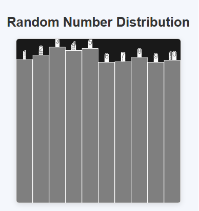

# Distribuição de Números Aleatórios

Este é um projeto simples que utiliza a biblioteca p5.js para visualizar a distribuição de números aleatórios em diferentes "bins" (caixas). O projeto gera números aleatórios e os distribui em 10 caixas, mostrando graficamente quantos números caem em cada uma delas. É uma ferramenta visual interativa que ajuda a entender como a função `random()` do p5.js funciona na prática.

## Como Funciona

O projeto cria uma tela de 400x400 pixels onde são desenhadas 10 caixas (bins). A cada frame, um número aleatório é gerado e atribuído a uma das caixas. A altura de cada caixa aumenta conforme mais números são atribuídos a ela. O processo continua até que uma das caixas atinja uma altura próxima ao topo da tela, momento em que a animação é interrompida.

### Código Principal

O código principal está no arquivo `main.js`. Aqui estão os principais componentes:

- **WINDOW_WIDTH** e **WINDOW_HEIGHT**: Definem o tamanho da janela (400x400 pixels).
- **WINDOW_COLOR**: Define a cor de fundo da janela (cinza escuro).
- **totalBins**: Define o número de caixas (bins) que serão usadas (10 no total).
- **countsPerBin**: Um array que armazena a contagem de números em cada bin, inicializado com zeros.

## Exemplo de Uso

Este projeto é uma excelente ferramenta para visualizar e entender a distribuição uniforme de números aleatórios. O usuário pode observar, em tempo real, como os números gerados entre 1 e 10 se distribuem de forma equilibrada entre os diferentes intervalos (bins). A função `random()` do p5.js garante que, ao longo do tempo, os números sejam distribuídos de maneira uniforme, o que é claramente representado pelo crescimento proporcional das barras no gráfico.

Abaixo está um exemplo de como a visualização se parece após alguns frames:

